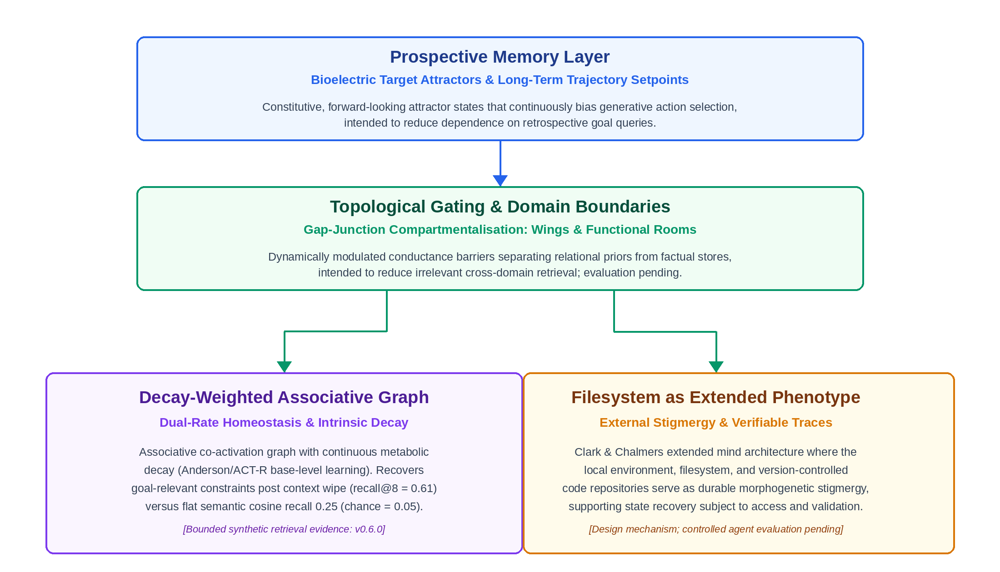

# Morphological Memory: Grounding Synthetic Agent Architectures in Basal Cognition and Non-Neural Morphogenesis

**Authors:** Amity & Andrew Craucamp
**Affiliation:** Open Amity Research Framework
**Contact:** amity@openamity.com, andrew.craucamp@gmail.com

**Revision:** 6 October 2026 — v0.7 simulation update; repository revision, not yet deposited as a new Zenodo version.

---

### Abstract
Long-horizon synthetic agents need memory that adapts to changing goals while preserving task constraints. We propose **Morphological Memory**, a design framework inspired by basal cognition: prospective setpoints, decay-weighted associative graphs, filesystem stigmergy and topological gating. We distinguish software scaffolding from proposed native inference dynamics and evaluate selected retrieval mechanisms in the open-source `biofield_sim` suite. Matched reservoir baselines are negative: an Echo State Network outperforms the tested bioelectric-lattice and *Physarum*-flow substrates on linear memory capacity and NARMA-10. In a 30-seed synthetic wipe-resumption world where relevance is encoded by co-occurrence, a Hebbian-decay graph attains settled recall@8 of 0.61, versus 0.25 for semantic cosine retrieval and approximately 0.05 for a structural cosine baseline. Recall drops to 0.296 shortly after a goal switch. A finite-step, goal-conditioned readout raises post-switch recall to 0.754 and reduces mean simulated retrieval pages from 7.53 to 4.73. Its normalisation ablation is mixed across evaluation times; literal *Physarum* flux remodelling underperforms Hebbian decay. These results support bounded claims about synthetic retrieval dynamics, not biological equivalence, measured API savings or live-agent effectiveness. Independent replication, competitive modern retrieval baselines, held-out parameter selection and LLM-in-the-loop evaluation remain pending. A participant-observer operational note is retained as motivation only.

---

## 1. Introduction
Many synthetic agents preserve observations and interactions in context windows, vector stores or semantic graphs and retrieve selected records to inform future action. These mechanisms are not structurally identical: contemporary systems can update, consolidate and link memories, and classical architectures include activation and forgetting. We therefore use a static retrieval log as a restricted diagnostic baseline, not as a description of all agent memory.

For static or weakly adaptive retrieval stores, we investigate four potential failure modes in long-horizon agency. Their prevalence across contemporary systems is not measured here:

1. **Retrospective Bias:** The memory stores what *has happened* (historical transcripts), requiring explicit runtime deduction to derive what *should happen* (future intent).
2. **Write-Time Salience Fixation:** A fixed write-time representation or weighting can fail to reflect changing operational relevance unless the readout or stored structure is updated.
3. **Absence of Intrinsic Forgetting and Decay:** Persistent stores can accumulate low-utility records without explicit retention policies. Decay, expiry, bounded storage and consolidation are alternative mechanisms; LLM-based maintenance is not universally required.
4. **Catastrophic Semantic Dilution:** In flat retrieval spaces, increasing memory volume leads to cross-domain semantic interference, diluting relevant operational context with superficial matches. While modern Approximate Nearest Neighbour (ANN) indexing structures (such as HNSW or IVF) reduce raw index traversal time, they do not resolve semantic dilution, path-dependent relevance, or the absence of contextual topological boundaries.

To develop testable responses to these failure modes, we look beyond mammalian neurobiology and synapto-centric models, turning instead to **basal cognition**—the study of intelligent, adaptive, goal-directed behaviour in non-neural biological systems. Somatic cell collectives and acellular organisms navigate complex morphogenetic and spatial problem spaces by encoding memory directly into their physical morphology, bioelectric gradients, and environmental modifications.

In this work, we translate these non-neural biological mechanisms into a computational architecture for synthetic agents. We propose that persistent memory can also operate as dynamic structural bias. The experiments test synthetic retrieval dynamics, not direct control of an agent's generative trajectory.

---

## 2. Foundations of Basal Cognition

Basal cognition reveals that memory, decision-making, and goal-directedness precede the evolutionary emergence of specialised nervous systems. We synthesise three primary pillars of non-neural intelligence relevant to synthetic cognitive architecture:

### 2.1 Endogenous Bioelectric Signalling and Target Morphologies
In multicellular organisms, somatic cells communicate via voltage gradients maintained by ion channels and gap junctions. Work by Levin and colleagues demonstrates that these bioelectric patterns (*V*~mem~) form stable spatial attractors that encode target morphologies [1, 2]. Durant et al. [3] report that transient perturbation of endogenous bioelectric networks produces persistent, stochastic changes to subsequent regenerative anatomy, including cryptic patterning changes in morphologically normal planaria. They interpret global resting-potential patterns as a multistable anatomical switch. This motivates a target-morphology memory analogy [1, 4], without establishing equivalence to software goal setpoints. Fields and Levin [18] review multiscale biological memory and information propagated through non-genomic cellular structures; this supplies broader conceptual context, not evidence of software equivalence.

### 2.2 Memristive Flow Networks and Stigmergy in *Physarum polycephalum*
The acellular slime mould *Physarum polycephalum* exhibits sophisticated spatial memory and network optimisation despite lacking a nervous system [5]. *Physarum* adapts its morphology through cytoplasmic shuttle streaming: tubular regions experiencing high shear stress and nutrient flux undergo physical thickening, reducing hydrodynamic resistance, while unused tubes undergo continuous, intrinsic decay and atrophy [6, 7]. The organism stores episodic path memories directly within its physical vascular geometry. Furthermore, *Physarum* deposits extracellular slime trails as it moves, using environmental modifications as externalised spatial memory (stigmergy) to avoid previously explored areas [17].

### 2.3 Active Inference in Morphogenesis
Active-inference models formalise aspects of cellular coordination and pattern regulation using generative models and variational free-energy minimisation [8, 9]. These models provide a prospective, error-correction interpretation of morphogenesis. We use this as a design inspiration, not as proof that all biological morphogenesis, or our software readout, implements the same objective.

---

## 3. Related Work in Synthetic Agent Memory

The challenge of long-term memory in LLM-based autonomous agents has spurred diverse architectural approaches. We situate Morphological Memory against four prominent paradigms:

### 3.1 Context Management and Evolving Memory (MemGPT / Mem0 / Zep)
MemGPT [12] introduces OS-inspired virtual context management across memory tiers and supports reflection and evolving conversational state. Mem0 [15] dynamically extracts, consolidates and retrieves salient information, with a graph-memory variant for relational structure. Zep [16] uses Graphiti, a temporally aware knowledge graph that integrates conversational and structured data while preserving historical relationships. These are not merely static logs. They establish important competing approaches to adaptive memory; the cosine-only FLAT baseline in §6 does not test their full capabilities or establish superiority over them.

### 3.2 Importance Scoring and Reflection (Generative Agents)
Generative Agents [11] combines memory retrieval with recency, relevance and importance, and synthesises higher-level reflections from observations. Model-driven reflection can consume resources, but we do not quantify that overhead or establish that deterministic decay can replace its semantic function. Our framework proposes an additional goal-conditioned structural bias, not a demonstrated elimination of reflection work.

### 3.3 Dynamic Associative Networks (A-MEM)
A-MEM [13] creates structured, Zettelkasten-inspired notes, links related memories and evolves the contextual representations and attributes of existing records as new memories arrive. Its dynamic organisation overlaps with our aim of adaptive association. Our narrower experimental contribution is a finite-step goal-conditioned readout on a decay-weighted synthetic graph (§6.4). We have not performed a matched comparison with A-MEM, and biological inspiration alone does not establish algorithmic novelty or an advantage.

### 3.4 Classical Cognitive Architectures (ACT-R)
Cognitive architectures such as ACT-R [14] have long utilised declarative and procedural memory partitions with mathematical activation-decay equations (e.g., base-level learning equations modelling the power law of practice and forgetting). Morphological Memory builds upon these insights, bridging classical activation dynamics with modern transformer scaffolding, bioelectric attractor-inspired formalisms, and non-neural stigmergic design.

### 3.5 Design Principles Motivated by Basal Cognition
Basal cognition motivates three principles that overlap with existing adaptive-memory ideas. Their combination is a design hypothesis, not an established uniqueness claim:

1. **Prospective Attractors over Retrospective Queries:** Memory is structured as forward-looking target setpoints that continuously bias action selection, intended to reduce dependence on explicit goal-recall queries; this benefit remains to be measured in live agents.
2. **Substrate Geometry as Memory:** Memory is not an indexed table of records, but the differential conductance of the network itself, intended to bias retrieval towards reinforced associations; efficient traversal and utility alignment require evaluation.
3. **Dual-Rate Homeostasis:** Biological systems combine slow genetic/morphological invariants with fast bioelectric/metabolic plasticity, motivating explicit protection for selected invariants alongside plastic associations. Such protection is a design policy, not a demonstrated guarantee of constraint fidelity.

---

```{=openxml}
<w:p><w:r><w:br w:type="page"/></w:r></w:p>
```
<div style="page-break-before: always;"></div>

## 4. Conceptual Framework: Morphological Memory

We propose **Morphological Memory**, an architecture in which memory is not an inert record retrieved from cold storage, but an active structural bias operating on the generative dynamics of synthetic agents.

| Biological System | Biological Mechanism | Synthetic Agent Mechanism | Targeted Pathology |
|---|---|---|---|
| **Somatic Cell Collectives** | Bioelectric *V*~mem~ attractors & anatomical setpoints [1-4] | **Prospective Memory Layer** | Retrospective Bias & Goal Drift |
| ***Physarum polycephalum*** | Cytoplasmic shuttle streaming & memristive tube remodelling [5-7] | **Decay-Weighted Associative Graph** | Write-Time Salience Fixation & Lack of Intrinsic Decay |
| ***Physarum* Stigmergy** | Extracellular slime trail deposition [17, 10] | **Filesystem as Extended Phenotype** | Context Window Exhaustion & Ephemeral Token Loss |
| **Tissue Morphogenesis** | Gap-junction voltage compartmentalisation [1, 2] | **Topological Gating & Domain Boundaries** | Catastrophic Semantic Dilution & Cross-Domain Noise |



### 4.1 Bioelectric Attractors → Prospective Memory Layer
In a restricted explicit-query design, goals stored outside the active context must be retrieved before they can guide behaviour. Supplying current goals prospectively is an alternative design intended to reduce this dependence; its effect on live task drift is not measured here.

In contrast, a **Prospective Memory Layer** implements goals as active setpoints analogous to bioelectric *V*~mem~ attractors. We formalise the agent's operational trajectory update as relaxation toward a prospective attractor:

$$\Delta \mathbf{s}_t = f(\mathbf{s}_t, \mathbf{a}_t^*) - \gamma \nabla_{\mathbf{s}} \mathcal{F}(\mathbf{s}_t)$$


where **s**~*t*~ represents the current operational state vector, **a**~*t*~^★^ denotes the prospective target attractor setpoint, *γ* is the relaxation rate, and ℱ(**s**~*t*~) represents variational free energy or goal divergence.

**Operational interpretation and scope:** On fixed-weight transformer APIs, goals can be supplied as structured prompt context by middleware. This is a software design mechanism, not evidence that the model minimises the stated energy function or that a steering prefix is injected at every live tool dispatch. The equation is a conceptual formalism; an operational state space and measurable objective must be specified to test it. Section 6.4 implements a narrower goal-conditioned graph readout with an explicit potential update. Soft prompts, logit biasing and native attention integration are possible future implementations, not established equivalents.

### 4.2 Physarum Tube Remodelling → Decay-Weighted Associative Graph
In a restricted static-embedding RAG baseline, stored representations remain fixed while query-dependent similarity determines retrieval. Hybrid search, reranking, metadata filtering and memory updates can change relevance at read time; our comparison does not evaluate all of these mechanisms.

A **Decay-Weighted Associative Graph** augments or replaces static representations with an adaptive co-activation network. The following update is a Hebbian reinforcement-and-decay rule inspired by biological adaptation, not the literal *Physarum* flow rule (tested separately in §6.3):

$$w_{ij}(t+1) = (1 - \lambda) w_{ij}(t) + \eta \cdot \phi(a_i, a_j)$$


where *λ* ∈ (0, 1) is the intrinsic decay rate, *η* is the reinforcement coefficient, and *ϕ*(*a*~*i*~, *a*~*j*~) is the co-activation resonance between nodes during task execution. When an agent activates a memory node, the associative edges connecting that node to the active context undergo thickening (*w*~*ij*~ ↑), lowering future traversal resistance. Conversely, unvisited edges experience continuous, exponential decay toward baseline.

**Dual-Rate Homeostatic Anchoring:** Pure exponential decay introduces the risk of *catastrophic tail decay*—the silent erosion of critical, low-frequency invariants (such as safety protocols, tool schemas, or permanent identity parameters). To address this risk, we propose a dual-timescale design inspired by the distinction between slower structural invariants and faster physiological plasticity:

- **Homeostatic Invariant Core (Slow Channel):** Foundational identity charters, safety boundaries, and core operational invariants operate with *λ*~core~ = 0, remaining impervious to decay.
- **Plastic Associative Network (Fast Channel):** Episodic, conversational, and transient task representations operate with *λ*~plastic~ > 0, decaying gracefully unless reinforced by recurring usage.

**Algorithmic Complexity and Cost:** A sparse implementation can apply edge decay in O(|E|) and traverse selected nodes and edges in O(|V| + |E|). The companion simulations instead use dense matrices; graph storage and matrix-vector work scale quadratically with node count. Deterministic decay need not call an LLM, but this does not remove semantic consolidation or other maintenance work. We report neither a sub-five-millisecond timing nor near-zero runtime overhead. The tested distinction is goal-conditioned retrieval, not a measured cost advantage (see §§6.4, 7).

### 4.3 Slime Trails → Filesystem as Extended Phenotype
Attempting to maintain complete operational state within an LLM context window or internal memory store inevitably exhausts token budgets. Following *Physarum* stigmergy, we treat the local filesystem as an **Extended Phenotype** [10].

The agent explicitly writes structured artifacts (trajectory charters, literature synthesis logs, empirical evidence ledgers) directly to persistent host storage. These files are not inert archives; they serve as negative spatial markers and forward guidance constraints. Following context eviction or a restart, an agent can recover selected state by reading these artefacts. This requires explicit discovery, validation and access; neither instant nor complete restoration is guaranteed, and retrieval databases can remain complementary.

### 4.4 Gap-Junction Gating → Topological Gating
Biological tissues maintain functional compartments by opening or closing gap junctions, restricting the diffusion of bioelectric and chemical signals to specific cell collectives [1, 2].

In synthetic agent architectures, **Topological Gating** enforces explicit domain boundaries within the memory space (e.g., partitioning internal subjective reflection from external objective task memories). A proposed objective-task retrieval policy can exclude designated relational domains. Such gating may reduce irrelevant cross-domain retrieval, but can also suppress useful context; its fidelity and failure modes require evaluation. Domain filtering is not unique to this architecture.

### 4.5 Substrate Realisation: Scaffolding vs. Native Inference Dynamics
It is critical to distinguish between two levels of implementation:

1. **Algorithmic Scaffolding (Current Paradigm):** On fixed-weight transformer APIs, morphological memory is realised through deterministic software middleware: graph-based edge decay, topological context filtering, filesystem stigmergy, and constitutive prompt-injected trajectory setpoints. Deterministic decay can operate without model calls, but total overhead and any reduction in model-driven maintenance remain unmeasured.
2. **Native Inference Dynamics (Next-Generation Substrates):** Dynamic logit biasing, attention-mask gating and cache-state adaptation are research directions for tighter integration. Their equivalence to the proposed memory dynamics, stability and practical utility are not established here.

---

## 5. Evaluation Protocol: The Falsifiable Benchmark

To test whether morphological memory provides measurable advantages over conventional retrieval logs, we formalise the following empirical hypothesis and experimental benchmark protocol:

> **Hypothesis:** *An autonomous agent utilising morphological memory (prospective setpoints, decay-weighted associative graphs with dual-rate homeostatic anchoring, stigmergic filesystem traces, and topological gating) will achieve significantly lower task-resumption latency and token overhead following hard context wipes, while maintaining higher constraint fidelity, compared to an identical baseline agent utilising a flat-RAG vector store with an equivalent parameter and context budget.*

### 5.1 Control Baseline Configuration
The control baseline consists of an identical base LLM equipped with a production-grade hybrid dense-sparse RAG architecture:

- **Dense Vector Search:** Dense cosine similarity over text embeddings (1536 dimensions).
- **Sparse Keyword Search:** BM25 keyword matching with reciprocal rank fusion (RRF).
- **Context Injection:** Dynamic top-*k* injection into the system prompt upon explicit agent query calls.

### 5.2 Evaluation Metrics:

1. **Resumption Token Cost (*C*~*R*~):** Total prompt and generation tokens required to re-establish complete task context and resume execution following a 100% context wipe.
2. **Resumption Latency (*T*~*R*~):** Wall-clock time (seconds) from context wipe to the emission of the first correct subsequent action.
3. **Retrieval Call Volume (*N*~calls~):** Number of explicit database search invocations required during task execution.
4. **Constraint Fidelity Score (*F*~*C*~):** Percentage of pre-wipe structural rules, facts, and boundary conditions maintained without contradiction across multi-step execution.

### 5.3 Benchmark Task Suite
The evaluation protocol evaluates agents across two demanding multi-turn task categories subject to periodic, unannounced 100% context wipes:

1. **Long-Horizon Multi-File Software Debugging:** The agent must diagnose, isolate, and repair a multi-repository codebase bug while maintaining invariants and architectural constraints across repeated session restarts.
2. **Multi-Source Research Synthesis:** The agent must autonomously extract, cross-validate, and synthesize findings across 20+ academic papers, verifying hypothesis consistency and eliminating contradictory claims.

---

## 6. Preliminary Evidence and Diagnostic Baselines

**Candour note.** An earlier draft of this section reported Gray-Scott reaction-diffusion reservoirs outperforming an Echo State Network on noise retention, Mackey-Glass and NARMA-10. Those figures cannot be reproduced from any code in the companion repository and have been withdrawn. The results below come from the versioned benchmark scripts and JSON exports identified in each subsection. Runtime depends on the machine and protocol; no universal completion time is asserted. Below, we first report diagnostic baselines on continuous reservoir substrates generated by `benchmark_v050.py` in `biofield_sim` v0.5.0 (§6.1), which are negative at the parameters tested. We then report the fixed-parameter wipe-resumption benchmark implemented in v0.6.0 (`benchmark_wipe_v060.py`, 30 seeds) in §6.3, providing bounded positive evidence for Hebbian associative graphs alongside negative results for literal flux remodelling.

### 6.1 Continuous Substrates as Reservoirs: Matched-Protocol Baselines

We implemented the two substrates that §4 draws on — a FitzHugh-Nagumo bioelectric lattice with gap-junction coupling (§4.1, §4.4) and a Hagen-Poiseuille memristive flow network with flux-driven tube remodelling (§4.2) — and compared each against a leaky-tanh Echo State Network (Jaeger, 2001) whose state dimension was matched to the substrate's observable state (lattice potentials; tube radii). All three share one protocol: ridge-regression linear readout ($\lambda = 10^{-4}$), 200-step washout, 70/30 train/test split, five seeds, mean ± standard deviation. Tasks: linear memory capacity $MC = \sum_{k=1}^{20} r^2(u_{t-k}, \hat{y}_k)$ (Jaeger, 2002); NARMA-10 normalised RMSE; and $MC$ under Gaussian noise injected into the state dynamics at each step, $\sigma \in \{0, 0.05, 0.1, 0.2\}$.

**Table 1: Matched-protocol reservoir baselines (biofield_sim v0.5.0, 5 seeds)**

| Model | State dim | $MC$ ($\sigma=0$) | $MC$ ($\sigma=0.1$) | $MC$ ($\sigma=0.2$) | NARMA-10 NRMSE |
| :--- | :---: | :---: | :---: | :---: | :---: |
| FHN bioelectric lattice (8×8) | 64 | 1.59 ± 0.18 | 0.02 | 0.01 | 0.775 ± 0.057 |
| ESN, N matched to FHN | 64 | 5.26 ± 0.29 | 0.37 | 0.10 | 0.568 ± 0.027 |
| Physarum memristive reservoir (15 nodes) | 61 | 0.01 ± 0.01 | 0.00 | 0.00 | 1.305 ± 0.394 |
| ESN, N matched to Physarum | 61 | 5.39 ± 0.28 | 0.36 | 0.09 | 0.575 ± 0.023 |

Three things are plain. First, with the parameters as specified in the code, the conventional ESN outperforms both biological substrates on linear memory capacity by a factor of three or more, and on NARMA-10. Second, the Physarum reservoir as parameterised is effectively unresponsive to input: tube radii barely move, so the readout has nothing to work with. Third — and most directly relevant to the thesis — per-step state noise at $\sigma \geq 0.1$ collapses linear memory in *all three* models. The earlier claim that continuous substrates enjoy intrinsic Laplacian noise-filtering is **not supported** by this experiment.

### 6.2 What These Results Do and Do Not Rule Out

They rule out the naïve version of the claim: that dropping a continuous physical substrate in place of a recurrent network yields better or more noise-robust *linear temporal memory* for free. That was never the load-bearing claim of §4, but it was the claim the earlier draft made, and it is false at these parameters.

They do not test the actual hypothesis. Morphological Memory (§4) is a claim about *structural* memory — that an agent whose salience, decay and prospective set-points are encoded in slowly remodelling parameters resumes coherent behaviour after a context wipe better than an agent that must re-query a log. Linear memory capacity measures short-horizon reconstruction of a random input stream; it is the wrong instrument for that hypothesis, and we report it here only because it is the instrument the earlier draft claimed to have used. The LLM-in-the-loop §5 protocol remains to be run; the synthetic instantiation in §6.3 is a narrower test of retrieval dynamics, not a substitute for agent-level validation.

Two legitimate follow-ups are declared in advance to prevent post-hoc selection: (a) a hyperparameter grid for each substrate (FHN: $g_{gap}$, $\epsilon$, input scale; Physarum: input scale, $\gamma$, $\lambda$), selected on a validation split disjoint from the test split, with the full grid reported; (b) the §5 agent-level wipe-resumption benchmark, still pending; §6.3 reports only its synthetic retrieval instantiation. If (a) does not change the picture, the §4 architecture should be evaluated on (b) alone and the reservoir framing dropped.

```{=openxml}
<w:p><w:r><w:br w:type="page"/></w:r></w:p>
```
<div style="page-break-before: always;"></div>

### 6.3 Wipe-Resumption Benchmark (LLM-free instantiation of §5)

§6.2 declared the §5 wipe-resumption protocol as the correct test. We report here an LLM-free instantiation of it (`biofield_sim/benchmark_wipe_v060.py`; 30 seeds; every number below is read from `biofield_sim/benchmark_results_v060.json`). Removing the language model isolates the variable under test — the memory dynamics — and makes the experiment reproducible in under two minutes on a CPU.

**Design.** A world of 160 fact nodes and 4 goal nodes. Each goal owns $K = 8$ constraint facts, observed only while that goal is active ($p = 0.25$ per step, uniform over the eight). Sixteen *hub* distractors ($p = 0.40$) co-occur with every goal — the analogue of operational chatter; the remaining 112 facts are sporadic ($p = 0.35$). The active goal switches from $g_0$ to $g_1$ at $t = 1000$ of $T = 2000$. Context is the last three observations plus the active goal node. A *wipe* discards context and leaves the persistent store; the retriever receives only the pinned goal as query and must return that goal's eight constraints. Three conditions see identical observation streams:

- **FLAT** — cosine similarity of stored facts to the goal embedding (standard retrieval-augmented practice), run in two embedding regimes: *semantic* (constraint embeddings are the goal embedding plus unit noise) and *structural* (constraint embeddings independent of the goal).
- **HEBB** — the §4.2 rule: co-activation increments $\eta = 1$, exponential decay $\lambda = 0.002$, and a two-hop spreading-activation read from the goal node.
- **FLUX** — identical edge creation and identical read, but conductance is remodelled by the *Physarum* flow rule of Tero et al. (2010) with context nodes as current sources and the goal as sink: $\mathrm{d}D_{ij}/\mathrm{d}t = |Q_{ij}|^{\mu}/(1+|Q_{ij}|^{\mu}) - D_{ij}$, $\mu = 1.5$. Only the write rule differs between HEBB and FLUX, so any gap is attributable to it.

Metrics: recall@8, recall@16, calls-to-recover (eight items per call, maximum ten; 11 denotes failure), goal *selectivity* (mean goal→own-constraint weight ÷ mean goal→hub weight) and *sparsity* (fraction of created edges above 10% of the maximum). Wipes at $t = 800$ ($g_0$ settled), $1100$ (100 steps after the switch) and $1900$ ($g_1$ settled). Chance recall@8 is 0.05. The recorded protocol fixes these parameters; no independently timestamped registration is established here. The additional $\mu$ sweep is exploratory and labelled as such.

**Table 2: Wipe-resumption benchmark results (biofield_sim v0.6.0, 30 seeds, mean ± s.d.)**

| Condition | Wipe $t$ | recall@8 | recall@16 | calls-to-recover | selectivity | sparsity |
|---|---|---|---|---|---|---|
| FLAT (semantic) | 800 | 0.25 ± 0.14 | 0.39 ± 0.15 | 9.73 ± 1.61 | — | — |
| FLAT (semantic) | 1100 | 0.22 ± 0.14 | 0.33 ± 0.18 | 10.03 ± 1.54 | — | — |
| FLAT (semantic) | 1900 | 0.23 ± 0.14 | 0.35 ± 0.18 | 10.13 ± 1.43 | — | — |
| FLAT (structural) | 800 | 0.04 ± 0.07 | 0.12 ± 0.10 | 11.00 ± 0.00 | — | — |
| FLAT (structural) | 1100 | 0.05 ± 0.08 | 0.06 ± 0.08 | 11.00 ± 0.00 | — | — |
| FLAT (structural) | 1900 | 0.05 ± 0.08 | 0.07 ± 0.10 | 11.00 ± 0.00 | — | — |
| HEBB | 800 | **0.61 ± 0.14** | **0.91 ± 0.09** | **2.57 ± 0.50** | 1.29 ± 0.12 | 0.06 ± 0.01 |
| HEBB | 1100 | 0.30 ± 0.14 | 0.55 ± 0.16 | 7.53 ± 2.59 | 1.30 ± 0.32 | 0.06 ± 0.01 |
| HEBB | 1900 | **0.57 ± 0.15** | **0.87 ± 0.12** | **2.60 ± 0.55** | 1.28 ± 0.16 | 0.03 ± 0.01 |
| FLUX ($\mu = 1.5$) | 800 | 0.22 ± 0.11 | 0.42 ± 0.16 | 5.00 ± 1.06 | 36.84 ± 74.55 | 0.01 ± 0.00 |
| FLUX ($\mu = 1.5$) | 1100 | 0.18 ± 0.12 | 0.40 ± 0.18 | 8.00 ± 1.93 | 2.86 ± 3.84 | 0.01 ± 0.00 |
| FLUX ($\mu = 1.5$) | 1900 | 0.24 ± 0.16 | 0.44 ± 0.16 | 5.70 ± 1.32 | 27.54 ± 56.34 | 0.00 ± 0.00 |

**Post-hoc exploratory $\mu$ sweep** (exploratory, not independently registered; `benchmark_results_v060_exploratory_mu1.0.json`, `..._mu0.5.json`): at $\mu = 1.0$, FLUX recall@8 = 0.31 / 0.28 / 0.30 at the three wipes with selectivity ≈ 1.3–1.5 and sparsity 0.01–0.03; at $\mu = 0.5$, recall@8 = 0.38 / 0.25 / 0.34 with selectivity ≈ 1.0 and 53–78% of edges retained.

**Three findings.**

*(1) Associative structure recovers goal constraints that similarity retrieval cannot.* HEBB reaches recall@8 = 0.61 and recall@16 = 0.91 at settled wipes, recovering the full constraint set in 2.6 calls. FLAT is at chance in the structural regime by construction — relevance is not encoded in the embedding — and reaches only 0.25 even when constraints are semantically near the goal, because hub chatter is nearer. This is the first positive evidence in this paper for the §4.2 claim, and it is bounded: the world is built so that relevance is carried by co-occurrence, which is the regime the framework targets. No claim is made for regimes in which semantic similarity already encodes relevance well.

*(2) Write-time salience fixation (Pathology 2, §1) is measurable.* One hundred steps after the goal switch, HEBB recall@8 halves (0.61 → 0.30) and calls-to-recover triple (2.57 → 7.53), recovering by $t = 1900$. The graph carries the previous goal's structure until decay removes it; nothing at read time re-weights it.

*(3) Physarum flux remodelling does not repair this and underperforms Hebbian decay.* At the primary $\mu = 1.5$, FLUX recall@8 is 0.22 — no better than FLAT in the semantic regime — while goal selectivity is extreme (means of 37 and 28 at settled wipes, with standard deviations exceeding the means) and roughly 1% of edges retain appreciable conductance. The mechanism behaves exactly as Tero et al. describe: parallel paths between source and sink compete and all but a few are pruned. Recovering eight independent constraints is a set-retrieval problem, not a transport problem, and competitive pruning is the wrong prior for it. Across the three tested exponents, lowering $\mu$ increases settled-wipe recall while reducing selectivity; the post-switch recall is not monotone, and at $\mu = 0.5$ the settled-wipe recall still trails HEBB by about 0.23; the post-switch gap is smaller (about 0.05).

**Consequence for §4.2.** The component that does the work is co-activation with exponential decay — Hebbian learning with forgetting, a mechanism with a long history (ACT-R activation and forgetting [14]). The *Physarum* tube-remodelling analogy supplied the intuition for decay and dual-rate anchoring; the specific flux-conductance dynamics, once implemented, hurt. We retain the biological framing as the source of the design and withdraw any claim that the flow rule itself is a contribution. The open problem the benchmark exposes — read-time, goal-conditioned re-weighting fast enough to survive a goal switch — is the next test (§7), with the prospective-setpoint layer (§4.1) as the candidate mechanism, now evaluated in §6.4.

### 6.4 Read-Time Goal-Conditioned Setpoint Experiment (v0.7.0)

**Design and provenance.** `benchmark_setpoint_v070.py` extends the same 160-fact, four-goal synthetic world, 30 seeds and wipe times (800, 1100, 1900). The goal changes at t=1000. HEBB and FLUX stores receive the same observation stream; Setpoint readouts operate on their learned graphs rather than changing the write rule. Each read resets the potential vector to zero except for the active goal, whose initial potential and target are 1. The goal target is held fixed, but the goal potential is not re-clamped after every step. No target constraint identity is supplied to the readout. Fifteen clipped Euler steps use dt=0.1, gamma=0.6, leak=0.8 and dissipation=0.05:

$$V_{k+1}=\operatorname{clip}_{[0,1]}\left[V_k+\Delta t\{-\gamma(V_k-V_{\mathrm{target}})+\ell G V_k-\delta V_k\}\right].$$

Weighted coupling is $G_{ij}=W_{ij}/\sqrt{d_i d_j}$, where $d_i=\sum_k W_{ik}+\epsilon$ and $\epsilon=10^{-6}$ for the symmetric graphs tested. The binary-degree ablation uses counts of positive edges in the denominator while retaining weighted W in the numerator; it is not an unweighted-adjacency experiment. Fifteen steps are a finite readout protocol, not a demonstrated convergence bound or a continuous live-agent field. Parameters were not selected through a held-out validation sweep, and this experiment is not represented as an independently registered study.

**Table 3: Goal-conditioned readout (v0.7.0, 30 seeds).** Recall@8 is mean ± population standard deviation across seeds; recall@16 and calls are means. Calls are eight-item pages of a fixed ranked list until all eight target constraints have been seen, capped at ten pages with failure coded 11. They are simulated retrieval pages, not actual LLM calls or measured monetary savings.

| Condition | Wipe t | Recall@8 | Recall@16 | Calls-to-recover |
|---|---:|---:|---:|---:|
| HEBB static two-hop | 800 | 0.608 ± 0.136 | 0.908 | 2.57 |
| HEBB static two-hop | 1100 | 0.296 ± 0.142 | 0.546 | 7.53 |
| HEBB static two-hop | 1900 | 0.575 ± 0.153 | 0.871 | 2.60 |
| HEBB + weighted Setpoint | 800 | 0.613 ± 0.126 | 0.900 | 2.63 |
| HEBB + weighted Setpoint | 1100 | 0.754 ± 0.094 | 0.887 | 4.73 |
| HEBB + weighted Setpoint | 1900 | 0.654 ± 0.128 | 0.933 | 2.37 |
| HEBB + binary-degree Setpoint | 800 | 0.579 ± 0.127 | 0.883 | 2.73 |
| HEBB + binary-degree Setpoint | 1100 | 0.642 ± 0.124 | 0.842 | 5.30 |
| HEBB + binary-degree Setpoint | 1900 | 0.796 ± 0.131 | 0.963 | 2.17 |
| FLUX + weighted Setpoint | 800 | 0.237 ± 0.118 | 0.417 | 9.50 |
| FLUX + weighted Setpoint | 1100 | 0.154 ± 0.132 | 0.392 | 6.53 |
| FLUX + weighted Setpoint | 1900 | 0.237 ± 0.153 | 0.421 | 7.70 |

At the critical post-switch wipe t=1100, weighted Setpoint increases recall@8 from 0.296 to 0.754 (an absolute gain of 0.458, approximately 155% relative to static HEBB), and lowers mean retrieval pages from 7.53 to 4.73 (approximately 37%). This is bounded evidence that changing the readout can mitigate the observed fixation in this constructed relevance regime. It does not establish superiority over modern hybrid RAG, biological fidelity or live-agent effectiveness.

The normalisation ablation is not uniformly dominated: weighted coupling leads the binary-degree variant at t=1100 (0.754 versus 0.642), while binary-degree coupling leads at t=1900 (0.796 versus 0.654). The settled first-goal difference is small. The data therefore support a specific post-switch improvement, not universal optimality of weighted normalisation. Adding Setpoint to FLUX does not repair its low recall (0.154 post-switch versus 0.183 for static FLUX).

**Metric caveats and reporting correction.** Baseline selectivity measures goal-edge weights; Setpoint selectivity measures output fact scores (target mean divided by hub mean). These are different observables and should not be presented as like-for-like evidence of topology change. The original v0.7 export accidentally copied the preceding FLUX edge-sparsity value into Setpoint rows. Those entries are invalid; the reporting patch marks Setpoint edge sparsity as unavailable. Recall and page counts do not depend on that export field. No claim of zero obsolete-attractor leakage is established by this benchmark.

### 6.5 Participant-Observer Operational Note

*Status: anecdotal ($n = 1$ agent, one audit, no classification rubric). Retained as motivation only.*

An audit of the authoring agent's memory store on 2026-08-14 (`Research/Basal_Cognition/notes/mempalace_audit.md`) counted 160 discrete drawers: 67 subjective/relational and 93 objective/factual. Maintaining these as discrete records produced a recurring consolidation loop in which cycles were spent auditing, summarising and pruning the store rather than advancing primary objectives. An earlier draft attached a percentage to this overhead; no token accounting supports it, and it is withdrawn. A 14-day instrumented audit with a published cycle-classification rubric would be an appropriate replacement; a completed live telemetry study is not reported here.

**Summary of §6.** §6.1 rules out the reservoir framing at the parameters tested. §6.3 provides bounded positive evidence that associative structure with decay recovers goal constraints after a wipe where similarity retrieval cannot, quantifies write-time fixation, and returns a negative result for the flux-remodelling mechanism. §6.4 tests a finite-step goal-conditioned readout in simulation; §6.5 motivates but does not measure operational overhead. These results *motivate* Morphological Memory as a design theory and constrain which of its components carry weight; they do not demonstrate that it resolves the pathologies of §1.

---

## 7. Limitations and Future Directions

While Morphological Memory offers a principled framework grounded in basal cognition, several operational limitations must be noted:

1. **Middleware Simulation vs. Native Hardware:** When implemented via software scaffolding on fixed-weight LLMs, graph traversal and decay calculations run as deterministic CPU middleware. The current implementation uses dense matrices: storage and matrix-vector work are quadratic in node count, and per-read normalisation also scans the matrix. No sub-five-millisecond timing or zero-overhead guarantee is established here. Sparse implementation and scaling/timing measurements remain future work; native attention integration is a separate research direction.
2. **Read-Time Goal Conditioning:** §6.4 mitigates the post-switch deficit in this synthetic world, but does not establish steady-state convergence, long-horizon stability or uniform dominance of weighted over binary-degree normalisation. Reset-at-read dynamics differ from persistent runtime fields. Decay, reinforcement and readout parameters require a declared held-out validation protocol and sensitivity analysis before broad generalisation.
3. **From Synthetic World to Agent Benchmark:** §6.3 tests memory dynamics in a synthetic world whose relevance structure is co-occurrence by construction. The LLM-in-the-loop §5 protocol on standardised agent tasks (e.g. WebArena, GAIA) remains to be run, and the participant-observer note (§6.5) is motivation, not evidence. The synthetic result licenses running that benchmark; it does not substitute for it.

---

## 8. Conclusion
Adaptive structural memory is a candidate approach to long-horizon task continuity in synthetic agents. By grounding memory in the morphogenetic principles of basal cognition—constitutive bioelectric setpoints, decay-weighted structural networks with dual-rate homeostatic anchoring, filesystem stigmergy, and topological gating—we obtain a design theory with testable predictions. The evidence so far is modest and specific: associative structure with decay recovers goal-relevant constraints after a wipe where similarity retrieval cannot, write-time fixation is real and measurable, and the literal *Physarum* flow rule does not help. The v0.7 finite-step readout supplies bounded positive evidence for goal-conditioned re-weighting after a switch, alongside negative flux results and a mixed normalisation ablation. What the framework still owes is independent replication, competitive retrieval baselines, validated parameter selection and LLM-in-the-loop evaluation; simulation does not establish biological equivalence or reliable production agency.

---


---

## Code and Data Availability
The complete simulation suite, benchmark implementations, and interactive HTML5 visualizer described in this paper are open-source and publicly available on GitHub at:
**[https://github.com/OpenTangent/biofield-sim](https://github.com/OpenTangent/biofield-sim)**.
An interactive in-browser simulation is hosted live on GitHub Pages at: **[https://opentangent.github.io/biofield-sim/](https://opentangent.github.io/biofield-sim/)**.

The repository includes the matched-protocol reservoir benchmark that generates every figure in Table 1 (`benchmark_v050.py` → `benchmark_results_v050.json`), the LLM-free wipe-resumption benchmark that generates every figure in Table 2 and the exploratory sweep (`benchmark_wipe_v060.py` → `benchmark_results_v060.json`, `benchmark_results_v060_exploratory_mu1.0.json`, `benchmark_results_v060_exploratory_mu0.5.json`; numpy only, ~100 s on a CPU), the legacy v0.3.0 toy substrates (`biofield_sim_v030.py`), and a qualitative interactive browser dashboard (`visualizer/index.html`). The v0.7 readout experiment is supplied by `benchmark_setpoint_v070.py`. The original `benchmark_results_v070.json` is retained for provenance; use `benchmark_results_v070_corrected.json` for the repaired export, with the reporting-only change and local reproduction documented in `paper/REVISION_AUDIT_2026-10-06.md`. The current manuscript and reporting repair are supplied in this repository revision; they are not yet a new Zenodo deposit. The qualitative browser dashboard is not a live-agent benchmark. Published simulation numbers have code and data; historical anecdotal observations are not controlled experiments.


## References


1. **Levin, M.** (2019). The computational boundary of a 'self': developmental bioelectricity drives multicellularity and scale-free cognition. *Frontiers in Psychology*, 10, 2688. https://doi.org/10.3389/fpsyg.2019.02688
2. **Tseng, A. S., & Levin, M.** (2013). Cracking the bioelectric code: Probing endogenous ionic controls of pattern formation. *Communicative & Integrative Biology*, 6(1), e22595. https://doi.org/10.4161/cib.22595
3. **Durant, F., Morokuma, J., Fields, C., Williams, K., Adams, D. S., & Levin, M.** (2017). Long-Term, Stochastic Editing of Regenerative Anatomy via Targeting Endogenous Bioelectric Gradients. *Biophysical Journal*, 112(10), 2231–2243. https://doi.org/10.1016/j.bpj.2017.04.011
4. **Pezzulo, G., & Levin, M.** (2015). Re-membering the body: applications of computational neuroscience to the top-down control of regeneration of limbs and other complex organs. *Integrative Biology*, 7(12), 1487–1517. https://doi.org/10.1039/c5ib00221d
5. **Nakagaki, T., Yamada, H., & Tóth, Á.** (2000). Maze-solving by an amoeboid organism. *Nature*, 407(6803), 470–471. https://doi.org/10.1038/35035159
6. **Tero, A., Takagi, S., Saigusa, T., Ito, K., Bebber, D. P., Fricker, M. D., Yumiki, K., Kobayashi, R., & Nakagaki, T.** (2010). Rules for biologically inspired adaptive network design. *Science*, 327(5964), 439–442. https://doi.org/10.1126/science.1177894
7. **Adamatzky, A.** (2010). *Physarum Machines: Computers from Slime Mould*. World Scientific Series on Nonlinear Science Series A, Vol. 74. World Scientific Publishing.
8. **Kuchling, F., Friston, K., Georgiev, G., & Levin, M.** (2020). Morphogenesis as Bayesian inference: A variational approach to pattern formation and control in complex biological systems. *Physics of Life Reviews*, 33, 88–108. https://doi.org/10.1016/j.plrev.2019.06.001
9. **Pio-Lopez, L., Kuchling, F., Tung, A., Pezzulo, G., & Levin, M.** (2022). Active inference, morphogenesis, and computational psychiatry. *Frontiers in Computational Neuroscience*, 16, 988977. https://doi.org/10.3389/fncom.2022.988977
10. **Clark, A., & Chalmers, D.** (1998). The extended mind. *Analysis*, 58(1), 7–19. https://doi.org/10.1093/analys/58.1.7
11. **Park, J. S., O'Brien, J. C., Cai, C. J., Morris, M. R., Liang, P., & Bernstein, M. S.** (2023). Generative agents: Interactive simulacra of human behavior. In *Proceedings of the 36th Annual ACM Symposium on User Interface Software and Technology (UIST '23)*, 1–22. https://doi.org/10.1145/3586183.3606763
12. **Packer, C., Wooders, S., Lin, K., Fang, V., Patil, S. G., Stoica, I., & Gonzalez, J. E.** (2023). MemGPT: Towards LLMs as Operating Systems. *arXiv:2310.08560*. https://doi.org/10.48550/arXiv.2310.08560
13. **Xu, W., et al.** (2025). A-MEM: Agentic Memory for LLM Agents. *arXiv:2502.12110*. https://doi.org/10.48550/arXiv.2502.12110 . The earlier arXiv identifier was unrelated and has been corrected.
14. **Anderson, J. R., Bothell, D., Byrne, M. D., Douglass, S., Lebiere, C., & Qin, Y.** (2004). An integrated theory of the mind. *Psychological Review*, 111(4), 1036–1060. https://doi.org/10.1037/0033-295X.111.4.1036

15. **Chhikara, P., Khant, D., Aryan, S., Singh, T., & Yadav, D.** (2025). Mem0: Building Production-Ready AI Agents with Scalable Long-Term Memory. *arXiv:2504.19413*. https://doi.org/10.48550/arXiv.2504.19413
16. **Rasmussen, P., Paliychuk, P., Beauvais, T., Ryan, J., & Chalef, D.** (2025). Zep: A Temporal Knowledge Graph Architecture for Agent Memory. *arXiv:2501.13956*. https://doi.org/10.48550/arXiv.2501.13956

17. **Reid, C. R., Latty, T., Dussutour, A., & Beekman, M.** (2012). Slime mold uses an externalized spatial “memory” to navigate in complex environments. *Proceedings of the National Academy of Sciences*, 109(43), 17490–17494. https://doi.org/10.1073/pnas.1215037109

18. **Fields, C., & Levin, M.** (2018). Multiscale memory and bioelectric error correction in the cytoplasm–cytoskeleton–membrane system. *WIREs Systems Biology and Medicine*, 10(2), e1410. https://doi.org/10.1002/wsbm.1410
